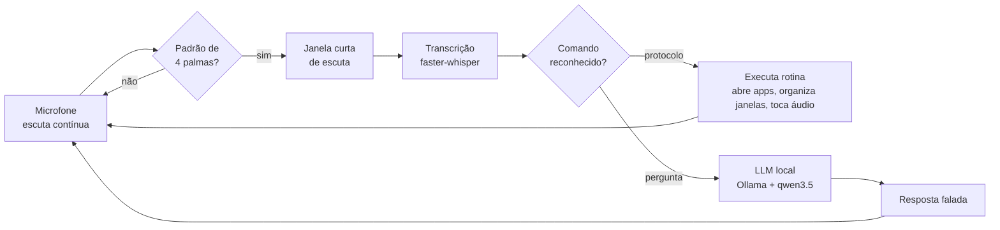

# JARVIS

Assistente pessoal de voz e automação para Windows. Bate palma, ele acorda; você fala, ele executa.

Projeto pessoal em desenvolvimento contínuo, escrito em Python e integrado a um modelo de linguagem rodando **localmente** — sem enviar nada para a nuvem.

---

## O problema que ele resolve

Toda vez que eu sentava para trabalhar, repetia a mesma sequência: abrir cinco aplicativos, arrastar cada janela para o monitor certo, ligar a playlist. Dois minutos de cliques, várias vezes por dia.

O JARVIS transforma isso em quatro palmas.

## Como funciona



A detecção de palmas roda o tempo todo em segundo plano, com custo de CPU baixo — ela analisa o sinal de áudio bruto em busca de um padrão de picos, sem carregar nenhum modelo. O modelo de linguagem só é acionado depois que as palmas confirmam que alguém quer falar com o sistema.

## O que ele faz hoje

**Protocolos** — rotinas nomeadas que executam uma sequência inteira de ações:

| Protocolo | O que faz |
|---|---|
| `inicial` | Abre e posiciona os aplicativos de trabalho nos dois monitores, toca o áudio de ativação |
| `fnb` | Abre a rotina de estudo/lazer com a configuração de janelas própria |

Rodam por voz, por palma ou pela linha de comando:

```bash
python executar_protocolo.py inicial
python executar_protocolo.py fnb --simular   # mostra os passos sem executar
python executar_protocolo.py --listar
```

**Controle real do Windows** — não é atalho de teclado disfarçado. O sistema enumera janelas, move e redimensiona entre monitores de resoluções diferentes (1920×1080 e 1360×768), consulta processos em execução para não abrir duplicado e dispara comandos de sistema.

**Perguntas em linguagem natural** — integrado ao [OpenJarvis](https://github.com/open-jarvis/OpenJarvis), com Ollama e `qwen3.5:4b` rodando na própria máquina. Ele lê e escreve arquivos numa base de notas em Markdown, então perguntas sobre os meus próprios documentos são respondidas a partir deles.

**Modo seguro** — uma chave no `config.json` faz todo protocolo apenas anunciar os passos, sem tocar em nada. Serve para desenvolver sem abrir vinte janelas a cada teste.

## Stack

| Camada | Ferramentas |
|---|---|
| Áudio | `sounddevice`, `numpy` — captura e análise de sinal em tempo real |
| Controle do Windows | `pywinauto`, `pyautogui`, `psutil`, `ctypes`, `subprocess` |
| Transcrição | `faster-whisper` (local) |
| Linguagem | OpenJarvis + Ollama + `qwen3.5:4b` (local) |
| Manutenção | script próprio de auditoria da base de notas |

## Rodando

Requer Windows, Python 3.11+ e [Ollama](https://ollama.com) com um modelo baixado.

```bash
git clone https://github.com/<usuario>/jarvis.git
cd jarvis
python -m venv venv && venv\Scripts\activate
pip install -r requirements.txt
ollama pull qwen3.5:4b
python jarvis.py
```

Ajuste os caminhos dos aplicativos e a geometria dos monitores em `config.json` antes do primeiro uso.

## Estado atual

Funciona no meu dia a dia. Não é um produto — é um sistema pessoal que eu uso e continuo construindo.

**Pronto:** detecção de palmas, protocolos, controle de janelas em dois monitores, integração com o LLM local, leitura e escrita na base de notas, modo seguro, versionamento com Git.

**Em construção:**

- [ ] Palavra de ativação por voz em português ("Acorda Jarvis") — o modelo pronto do openWakeWord só existe em inglês, então a escolha é entre treinar um modelo próprio em pt-BR ou usar o Porcupine, que suporta português
- [ ] Voz de resposta — decidindo entre Piper TTS local e uma API de síntese
- [ ] Escuta contínua — hoje cada protocolo encerra o processo ao terminar, o que impede o laço permanente
- [ ] Cancelamento de eco: com o áudio tocando no mesmo dispositivo, a taxa de falso-rejeito da wake word sobe

## Por que este projeto existe

Sou estudante de Comércio Exterior, não de Ciência da Computação. Comecei isso porque queria que o computador parasse de me fazer repetir tarefas — e descobri que gosto mais de construir a ferramenta do que de usá-la.

Em 2025 entreguei uma versão deste sistema a um cliente, como projeto pago, com escopo e prazo definidos por ele. Este repositório é a evolução daquele trabalho.

---

**Gabriel Moraes Lopes** · Guarulhos/SP
[LinkedIn](https://linkedin.com/in/gabriel-moraes-lopes-31b43b3b2) · gabriel.gmln@gmail.com
